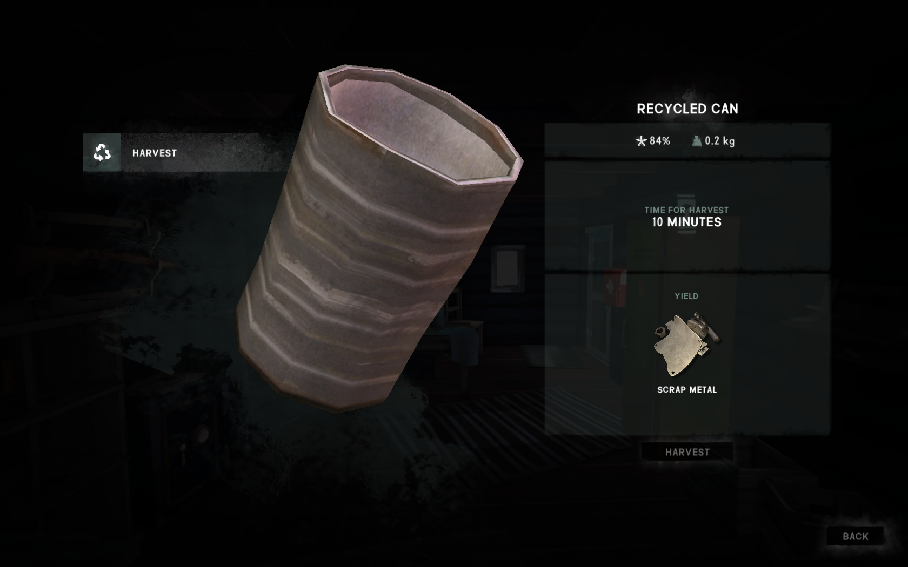

# BreakDownCans

A super simple mod that lets you break down a Recycled Can for a single piece of Scrap Metal.

## Installation

### TLD 1.56
1. If you haven't done so already, install the [Mod Loader](https://github.com/zeobviouslyfakeacc/ModLoaderInstaller)
2. Install the mod automatically by using [WulfMarius's Mod-Installer](https://github.com/WulfMarius/Mod-Installer/releases)

or

1. If you haven't done so already, install the [Mod Loader](https://github.com/zeobviouslyfakeacc/ModLoaderInstaller)
2. Download the latest version of `BreakDownCans.dll` from the [releases page](https://github.com/zeobviouslyfakeacc/BreakDownCans/releases) - version v1.xx
3. Move `BreakDownCans.dll` into the mods folder in your TLD install directory

### TLD 1.83+
1. Download and install MelonLoader
2. Download the latest version of `BreakDownCans.dll` from the [releases page](https://github.com/zeobviouslyfakeacc/BreakDownCans/releases) - version v2.xx
3. Move `BreakDownCans.dll` into the mods folder in your TLD install directory

## Screenshots

